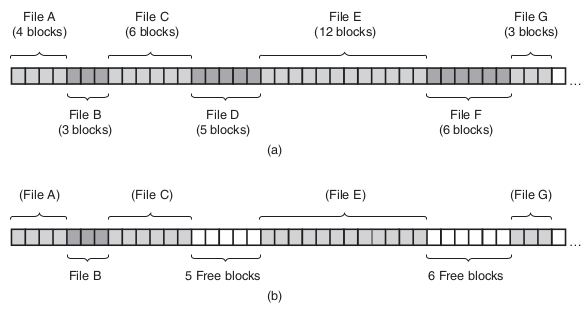
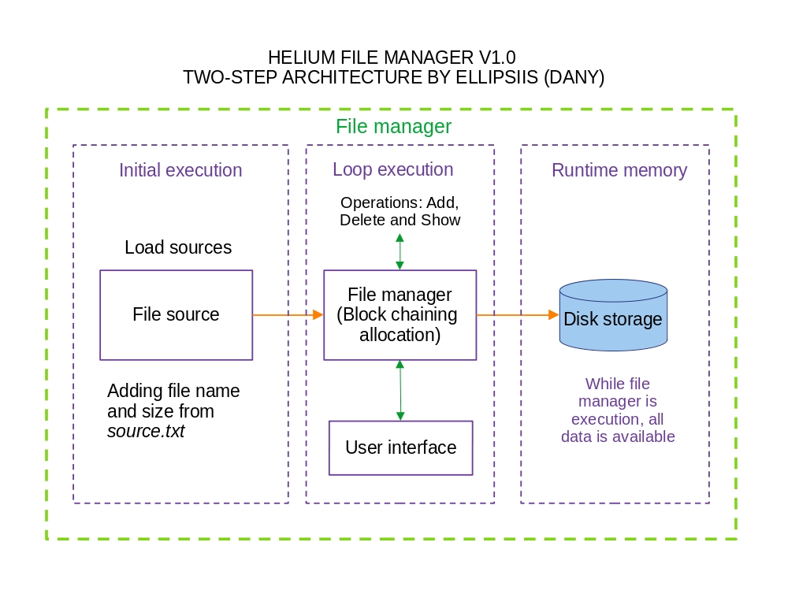
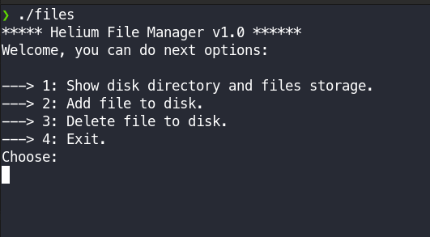

# File Management by Block Chaining

## Introduction

This proyect is a module that organize and manage files to process their sizes and names by storage. This storage is a disk with several tracks and sectorst that must be managed by this program. This module is a file manager by block chaining. For more details see the next section where I explain what is block chaining management. 

## Block chaining management

Every operative system has file management implementation inside it, and this implementation should be manage and allocate every file in system storage. One of the most simpliest is contiguous allocation by blocks, and inside this implementation we can found management by block chaining. This contiguous implementation take every file name and link to the file size. File size is divided by block size and it will calculate the number of blocks that this file will take on disk. The most important condition to do this operation is found a serie of free contiguous blocks to storage the all blocks of the file.

<p align="center"></p>

*a) Contiguos allocation of disk space for seven files.*

*b) The state of the disk after files D and F have been deleted.*

## Requirements

1. It must be add all files allocated in source file `source.txt` and organize all files into disk.
2. It must be delete any file from disk and show which blocks are free after the operation. 
3. It must be have an user interface with next options: first, show all files allocates into disk where every record, all block that file was taken, name of file, size of file and show if exist fragments into block.
4. Add file to disk and show name, size, blocks that file was taken and show if exist fragments into block.
5. Remove file and show which blocks are free now, name and size of file was deleted.
6. If you add new files in `source.txt` they will be load when you show information.

## Architecture

<p align="center"></p>

## Technologies

1. Ansi C.
2. GNU/Linux (Debian).
3. GCC v4.10.2.1-1.

## Build

**GNU/Linux instructions & Mac OS**

For compile the file manager, you must be in directory where the source code that was named `files.c`. So, for this example, our source code is alocated in `~/block_chain_managment/`, in the same directory must be place the `source.txt` file because this file has all files with their names and sizes that will load into disk. Really I recommend you use a GCC long support version or if you want the lastest version. Next compile with:

```console
$ gcc files.c -o any_name_you_want 
```
And if your compilation is sucess, you get a executable which you named with last command that is above, now you list with `ls -hal` and show the executable that was created.   

**Windows**
I recommend you install the compiler GCC for windows and execute the same instructions for **GNU/Linux** & **Mac OS**. You can download GCC compiler from https://gcc.gnu.org/.

## Test

You only execute in terminal the executable that we was created in **Build** section, follow me on next commands:
```console
$ ./any_name_you_want
```
The output will be this: 

<p align="center"></p>

why the command `./files`,  this command is why when I was compiled the source file, the name that I chosee was *files*, so, don't scare. 

**ENJOY THIS FILE MANAGER** and feel free to use in your carreer, school or job, only **don't forget mentioned me @ellipsiis in your modification or implementation** :thumbsup:, every code has a lot time of work and long times of think how solve the problem. Share with me your version or upgrade implementation and let's see together your surprise :smile:.
